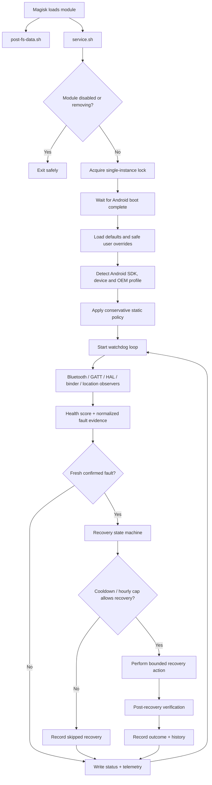
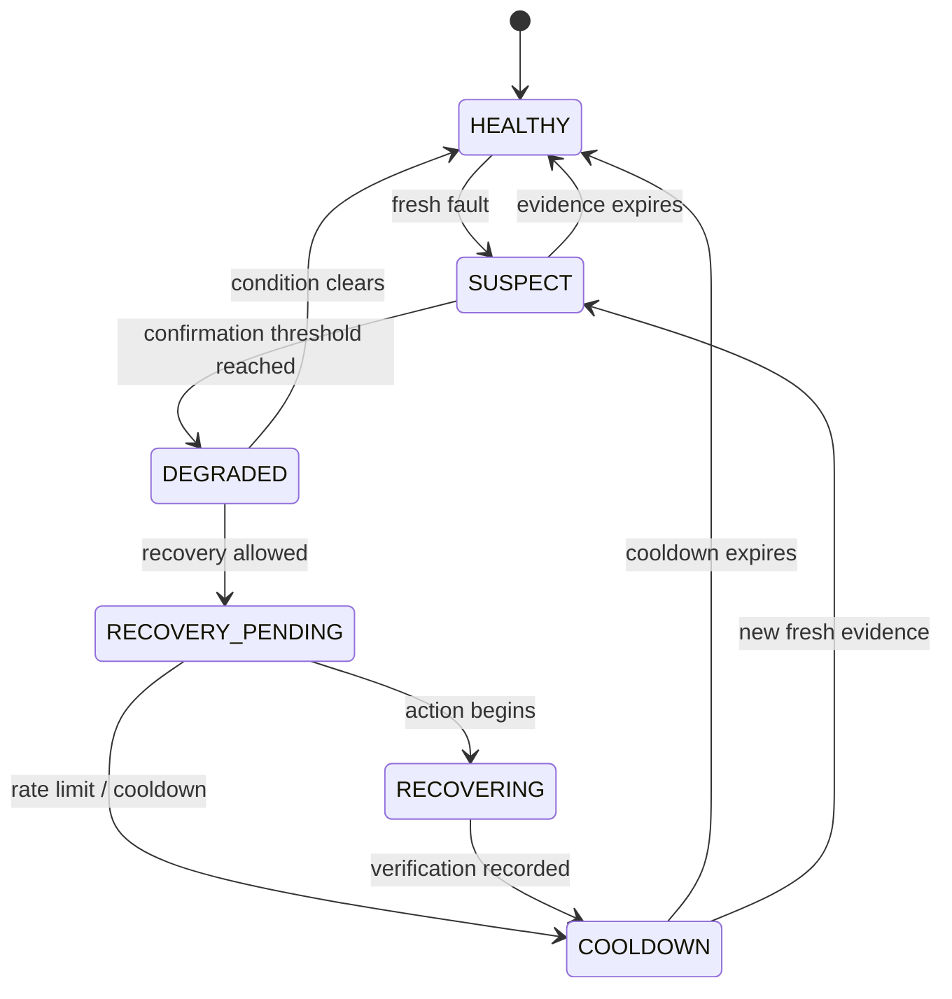
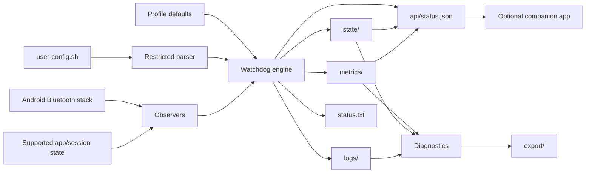
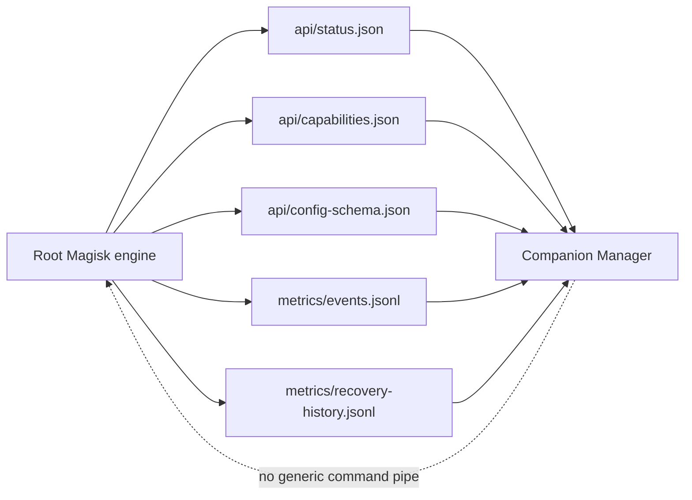

# Bluetooth Stability Helper Architecture

This document describes how the Magisk module starts, selects policy, monitors Android Bluetooth health, records telemetry and performs evidence-based recovery.

> GitHub renders the diagrams below with Mermaid. They can be opened in GitHub's diagram viewer and are easier to inspect than static screenshots.

## System overview



## Recovery state machine



## Runtime components

| Component | Responsibility |
| --- | --- |
| `customize.sh` | Install/upgrade entry point, payload validation and environment reporting |
| `post-fs-data.sh` | Early Magisk lifecycle hook |
| `service.sh` | Long-running watchdog orchestration and recovery controller |
| `common/config.sh` | Safe defaults and validated tuning values |
| `common/profiles/*.sh` | OEM-specific conservative policy |
| `scripts/lib.sh` | Shared Bluetooth, package, logging and config helpers |
| `scripts/telemetry.sh` | Structured bounded events and recovery-state tracking |
| `scripts/diagnostics.sh` | Human-readable diagnostic/support export |
| `scripts/manager_api.sh` | Atomic read-only JSON contract for the optional companion app |
| `companion-app/` | Native Android presentation/support layer; never performs recovery decisions |
| `verify.sh` | Non-destructive runtime and installation verification |
| `action.sh` | Magisk Action entry point |

## Data flow



## Boot sequence

1. Magisk mounts the module.
2. `service.sh` exits immediately if the module is disabled or scheduled for removal.
3. A lock prevents duplicate watchdog processes.
4. The service waits for `sys.boot_completed=1` plus a short stabilization delay.
5. Defaults are loaded, then the OEM/Android profile is selected.
6. Restricted user overrides are parsed and range-validated.
7. Optional reversible static tuning is applied.
8. The watchdog writes its PID/start/heartbeat state and enters the monitoring loop.

## Fault evidence

Observers look for current concrete signals rather than app names or session age alone. Examples include:

- GATT status failures and timeouts
- HCI/L2CAP failures
- Bluetooth binder or service death
- adapter/manager state inconsistencies
- confirmed location/fused-provider stalls
- Android 16/17 Companion Device and bond-change observations

Duplicate or stale log events are rejected so one old log line cannot repeatedly advance recovery.

## Recovery safeguards

Recovery is bounded by:

- profile-specific confirmation thresholds
- a fresh-fault time window
- recovery cooldown
- maximum recoveries per hour
- Android-version/OEM policy
- post-recovery verification

App force-stop is disabled by default. Unsupported Android versions and selected conservative profiles can disable automatic adapter recovery completely.

## Persistent storage

```text
/sdcard/Bluetooth-Stability-Helper/
├── logs/       # bounded event logs
├── state/      # heartbeat, fault and recovery state
├── metrics/    # health, event and recovery history
├── export/     # bounded diagnostics/support exports
├── api/        # read-only manager JSON contract
├── import/
├── status.txt
├── install-report.txt
└── user-config.sh
```

Recovery/event history survives reboot but remains capped. Temporary log signatures and disposable exports may be cleaned during boot.

## Security boundary

Shared storage is never sourced as arbitrary root shell. Only documented scalar configuration values are accepted and range-validated.

The module does not add Zygisk, Xposed, ART hooks, remote command execution, Play Integrity spoofing or application injection.


## Companion-app boundary



The manager contract is deliberately read-only. The included native Android app presents health, timeline, profile and support metadata without becoming a second recovery engine or exposing arbitrary root commands.

The app reads only fixed BSH paths through `su`, so it does not need broad shared-storage permissions. Root denial, a missing module and schema mismatch are surfaced as app status.

Future write support should use explicit allow-listed actions and transactional configuration changes rather than unrestricted shell execution. See [docs/MANAGER_API.md](docs/MANAGER_API.md).
