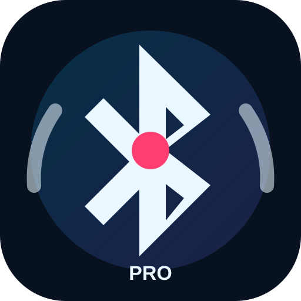

# Bluetooth Stability Helper



**v0.9.0 Adaptive Bluetooth Stability Engine**

A Magisk module focused on reducing Bluetooth and BLE dropouts on Android 12-16, with Pixel-first tuning and extra awareness for Pokémon GO, Pokemod from Pokemod.dev, and **VPGP³+** style Virtual Pokémon GO Plus sessions.

## What changed in v0.9.0

- Replaced the old multi-mode flow with one standard adaptive engine.
- Pixel-first Bluetooth/BLE stability checks for Android 12-16, especially Android 16.
- Stronger Bluetooth process, `bluetooth_manager`, HAL, GATT, and BLE stall observation.
- Better VPGP³+ stale-session detection for the pattern where spinning/catching works for a while and then stops.
- Pokémon GO, Pokemod, and Bluetooth-aware game/app detection.
- Safe AppOps and device-idle allowances for Bluetooth, Google Play services, Pokémon GO, Pokemod, and known Bluetooth game candidates.
- Logs/config/status kept under `/sdcard/Bluetooth-Stability-Helper/`, not Downloads.
- GitHub/Magisk update JSON retained.
- Vector/LSPosed safe: this module does not install hooks or modify Vector.

## Runtime files

```text
/sdcard/Bluetooth-Stability-Helper/
├── user-config.sh
├── status.txt
├── logs/
├── state/
├── export/
└── import/
```

## User config

The module now uses one adaptive profile by default. Edit this file only when you want to override behaviour:

```text
/sdcard/Bluetooth-Stability-Helper/user-config.sh
```

Common safe overrides:

```sh
WATCHDOG_INTERVAL=40
STALE_SESSION_MINUTES=42
ENABLE_A2DP_OFFLOAD_DISABLE=1
MAX_RESTARTS_PER_HOUR=4
```

## Pokémon GO / Pokemod / VPGP³+ focus

The module checks for:

- `com.nianticlabs.pokemongo`
- `com.pokemod.app.public`
- other Pokemod/VPGP³+ candidate packages
- other likely Bluetooth-aware Niantic/game packages

It does not automate gameplay. It focuses on Android Bluetooth, BLE, location, idle, and diagnostics stability.

## GitHub updater

`module.prop` points to:

```text
https://raw.githubusercontent.com/RogueAssassin/Bluetooth-Stability-Helper/main/update.json
```

Each future update should increase both `version` and `versionCode`, publish the Magisk ZIP as a GitHub Release asset, and update `update.json`.
