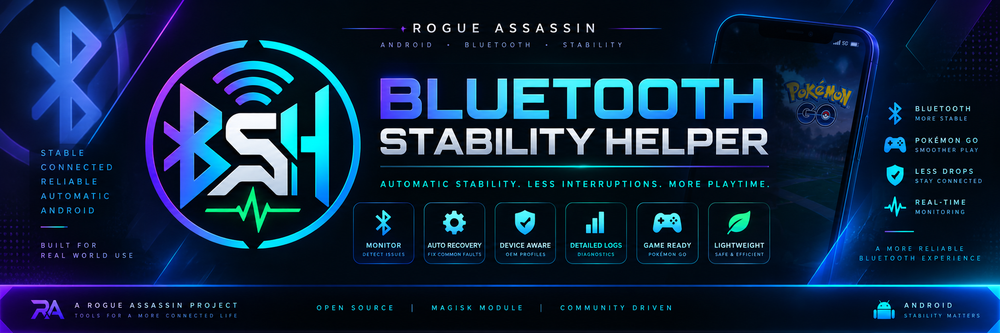

<div align="center">



# Bluetooth Stability Helper

**Pixel-first Adaptive Bluetooth Stability Engine for Android**

[](https://github.com/RogueAssassin/Bluetooth-Stability-Helper/tree/testing)
[](https://github.com/RogueAssassin/Bluetooth-Stability-Helper/actions/workflows/package.yml?query=branch%3Atesting)


</div>

Bluetooth Stability Helper is a Magisk module designed to improve Android Bluetooth, BLE, GATT, Companion Device, location, and idle-service stability. It is built mainly for Google Pixel devices while retaining safer support for other Android brands.

It is especially useful when Bluetooth-heavy apps are active, including **Pokémon GO**, **Pokemod from Pokemod.dev**, and **VPGP³+** style virtual accessory sessions.

## 1.4.0 testing — companion-app foundation

The 1.4 testing line adds a stable, read-only manager data contract so the upcoming companion app can display detailed health and recovery information without duplicating the root recovery engine.

- publishes atomic `api/status.json`, `api/capabilities.json`, and `api/config-schema.json` snapshots
- declares API schema version 1 for future app compatibility
- exposes health score, OEM profile, recovery state, last fault/outcome, adapter/process state, watchdog heartbeat, Android/build data and supported active-app state
- exposes bounded telemetry/recovery file locations for timeline and support views
- documents safe config min/max values for future UI controls
- deliberately provides no arbitrary shell command channel or generic remote root execution
- refreshes manager data from the service, Magisk Action and diagnostics flows

See [Manager API](docs/MANAGER_API.md) for the contract and security boundary.

## 1.3.0 stable

Bluetooth Stability Helper 1.3.0 focuses on observability and long-session reliability rather than more aggressive Android tweaks.

- preserves recovery history and health metrics across reboot with bounded retention
- adds watchdog PID/start/heartbeat state so a running-but-stalled service can be detected
- validates numeric user overrides against safe ranges instead of accepting any integer
- expands diagnostics with heartbeat age, normalized event history, recovery state and verified recovery outcomes
- uses the supplied full-resolution BSH banner and logo as the canonical Rogue-style project branding
- adds a HEALTHY → SUSPECT → DEGRADED → RECOVERY_PENDING → RECOVERING → COOLDOWN state model while keeping adapter recovery evidence-based and conservative

An optional companion manager app is now being prepared against the v1.4 read-only manager contract as a status, configuration and support-bundle surface. The root module remains fully functional without it and does not require Zygisk/Xposed hooks.

## Key features

- Pixel-first Bluetooth stability tuning for Android 12–17.
- Evidence-based Bluetooth health engine with BLE, GATT, HAL, binder, location, and idle-state checks.
- Pokémon GO and Pokemod awareness by package/name detection only.
- VPGP³+ stall observation that requires concrete, fresh fault evidence before recovery.
- Duplicate log-event suppression so one old log line cannot repeatedly toggle Bluetooth.
- Android 17 bond-loss observation that allows the platform's autonomous re-pairing to work.
- Reversible optional global tuning; conservative system defaults remain unchanged.
- Modern verified installer with device, root-manager, Bluetooth-stack and profile reporting.
- Conservative profiles for major Android manufacturers with automatic safe fallback.
- Recovery history and health metrics stored under `/sdcard/Bluetooth-Stability-Helper/`.
- Vector/LSPosed safe: no app hooks, Zygisk hooks, or Xposed modules are installed.


## Logging safety

Logging is capped and event-based so the helper does not fill phone storage.

- Old logs and exports are cleaned on reboot.
- Routine healthy-loop messages are suppressed by default.
- The active log rotates at 256 KB and keeps only a small number of rotated files.
- Exported diagnostics and Pixel snapshots are capped.
- Recovery history is trimmed automatically.

Useful overrides in `/sdcard/Bluetooth-Stability-Helper/user-config.sh`:

```sh
LOG_IMPORTANT_ONLY=1
LOG_BOOT_CLEAN=1
LOG_ROTATE_SIZE_KB=256
LOG_MAX_TOTAL_MB=10
EXPORT_MAX_FILES=8
RUN_DIAGNOSTICS_ON_BOOT=0
```

## Runtime files

```text
/sdcard/Bluetooth-Stability-Helper/
├── user-config.sh
├── install-report.txt
├── status.txt
├── logs/
├── state/
├── metrics/
├── export/
└── import/
```

## Supported Android range

- Android 12 / 12L
- Android 13
- Android 14
- Android 15
- Android 16
- Android 17

Pixel devices receive the most specific tuning. Every other profile keeps vendor properties untouched and uses slower confirmation thresholds.

| Detected devices | Runtime profile | Default recovery policy |
| --- | --- | --- |
| Google Pixel | Primary Pixel | 2 faults in 3 minutes; maximum 2 recoveries/hour |
| Samsung / One UI | Conservative Samsung | 3 faults in 4 minutes; maximum 1 recovery/hour |
| Xiaomi / Redmi / Poco | Conservative Xiaomi | 3 faults in 4 minutes; maximum 1 recovery/hour |
| OnePlus / Oppo / Realme | Conservative OPlus | 3 faults in 4 minutes; maximum 1 recovery/hour |
| Nothing, Motorola, ASUS/ROG, Sony, Vivo/iQOO | Conservative OEM | 3 faults in 4 minutes; maximum 1 recovery/hour |
| Huawei / Honor | Diagnostic fallback | Automatic adapter recovery disabled |
| Unknown OEM on Android 12–17 | Generic safe fallback | 3 faults in 4 minutes; maximum 1 recovery/hour |
| Android outside 12–17 | Unsupported fallback | Diagnostics only; automatic recovery disabled |

## Pokémon GO / Pokemod / VPGP³+ support

The module checks for names/packages such as:

- Pokémon GO: `com.nianticlabs.pokemongo`
- Pokemod: `com.pokemod.app.public` plus fallback Pokemod package names
- VPGP³+: Pokemod/VPGP³+ candidate labels

It does not track or enforce app versions. It does not automate gameplay. It focuses on Android Bluetooth/BLE/location stability and diagnostics while those apps are active.

## Optional user config

The module works out of the box. Optional overrides live here:

```text
/sdcard/Bluetooth-Stability-Helper/user-config.sh
```

Common safe overrides:

```sh
WATCHDOG_INTERVAL=40
STALE_SESSION_MINUTES=20
ENABLE_A2DP_OFFLOAD_DISABLE=0
MAX_RESTARTS_PER_HOUR=2
RECOVERY_COOLDOWN=600
```

## Install

1. Install the module ZIP in Magisk.
2. Review the detected device, Bluetooth stack and selected profile shown by the installer.
3. Reboot.
4. Let the module run automatically.
5. Check `install-report.txt` and `status.txt` under `/sdcard/Bluetooth-Stability-Helper/`.

The installer distinguishes a clean installation from an upgrade, validates every required file and shell script, and preserves restoration data from the previous version. Existing external user configuration is not overwritten.

## Project assets

The uploaded full-quality PNG artwork is the canonical project branding:

- `assets/BSH-Bluetooth-Stability-Helper-Banner.png` — README and project banner.
- `assets/BSH-Bluetooth-Stability-Helper-Logo.png` — primary BSH logo and future manager-app identity.

Lower-quality legacy and temporary SVG branding has been removed so GitHub always renders the supplied originals.


## Current Pixel patch awareness

The module records SDK, build family, and security-patch drift rather than depending on one firmware identifier. It recognises the July 2026 `CP2A.260705` family and the Android 17 QPR1 `CP31` line while keeping recovery decisions based on runtime fault evidence.

## Recovery policy

The helper does not treat an app name or a long-running session as a fault. A recovery requires two fresh, concrete failure observations within three minutes, such as repeated GATT errors, binder death, or a confirmed Bluetooth manager/process failure. Recoveries are capped at two per hour with a ten-minute cooldown. Bond and Companion Device events on Android 17 are diagnostic-only so the operating system can complete autonomous re-pairing.

The shared-storage `user-config.sh` file is parsed as a restricted set of scalar overrides; it is never executed as unrestricted root shell code.

## Compatibility and installation safety

The installer reports the install mode, root manager/version, Android version, build, security patch, device manufacturer, SoC, architecture, SELinux state, Bluetooth stack, installed target apps and selected OEM profile. It validates the complete payload and all shell syntax before installation finishes. The Action button produces current diagnostics, while `verify.sh` performs a non-destructive service and compatibility check.

No module can honestly guarantee identical behaviour on every vendor ROM without device testing. Unknown devices therefore receive the generic safe profile, and unsupported Android versions receive diagnostics only. This prevents guessed vendor tweaks from being applied merely to claim compatibility.

The project does **not** include Play Integrity spoofing, keybox management, Zygisk injection, app hiding, device fingerprint modification, or changes to LSPosed/Vector.

## Implementation references

The installation and lifecycle design was reviewed against the official [Magisk module developer guide](https://topjohnwu.github.io/Magisk/guides.html), the established [MMT-Extended module template](https://github.com/Zackptg5/MMT-Extended), and the mature [Advanced Charging Controller](https://github.com/VR-25/acc) module. They are design references only; Bluetooth Stability Helper retains its own implementation and purpose.
